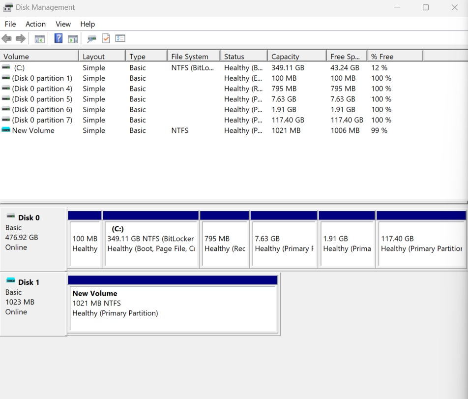

# Simulating-the-Forensics-Lab-Basics

# Name: Mohan S
# Register Number: 212223240094

# AIM:

To install VirtualBox and set up a virtual machine(Kali Linux), install Autopsy and Sleuth Kit, and use them for forensic investigation by analyzing disk storage and file system.

# Implementation Steps :

# Step 1: 
Install VirtualBox

# Installation Steps:

1.Download the Windows hosts .exe file from the official VirtualBox website

2.Run the installer and follow the on-screen instructions

3.Once installed, launch VirtualBox to verify the installation.

# Step 2:
Install Kali Linux on VirtualBox

# Installation Steps:
1.Download the Kali Linux ISO file.Open VirtualBox, click New, enter "Kali Linux", select Type: Linux and Version: Debian (64-bit)

2.Set RAM to at least 4GB ,Set disk storage to at least 30GB, choose Dynamically Allocated or Fixed Size, and create the VM.

3.Go to Settings > Storage, click Empty under Controller: IDE.

4.Select Graphical Install, follow the prompts to set language, location, username, and password.

5.Choose Partitioning Method (Guided - Use Entire Disk) and wait for installation to complete.

# Step 3:
Install Autopsy (GUI-based Forensic Tool)

# Installation Steps:
1.Download the Autopsy Windows Installer from the official website.
2.Extract the ZIP file and open the bin folder
3.Run autopsy.exe and set up a new forensic case for analysis.

# Step 4:
Install Sleuth Kit (CLI-based Forensic Tools)

# Installation Steps:
1.Download the Windows ZIP package from the official website.

2.Extract the ZIP folder and move it to a suitable directory (e.g., C:\sleuthkit).

3.Add the bin folder to Windows PATH:
    *Open Control Panel → System → Advanced System Settings.
    *Click Environment Variables → Edit Path.
    *Add the Sleuth Kit bin folder path and save changes.

4.Verify installation by running:
```python
fls -version
```    

# Step 5: Create & Configure a Virtual Hard Disk (VHD) in Windows
1. Press Win + X, Select Disk Management.
2.Click Action > Create VHD.
3.Choose a location and set a disk size (e.g., 10GB+).
4.Select Fixed Size or Dynamically Expanding and click OK.
5.In Disk Management, find your new disk (marked as "Not Initialized")   -> Right-click the new disk → Initialize Disk → Select MBR.
6.Right-click Unallocated Space → New Simple Volume → Format the disk -> Click next → Finish.

# Output:

# Virtual Box:


# Virtual Machine (Kali Linux):


# Autopsy:


# Sleuth Kit:


# Creation of Virtual Hard Disk:



# Result:

The installation of VirtualBox, Autopsy, and Sleuth Kit, along with the setup of Kali Linux - Virtual Machine and the creation of a new virtual disk, has been successfully completed.


